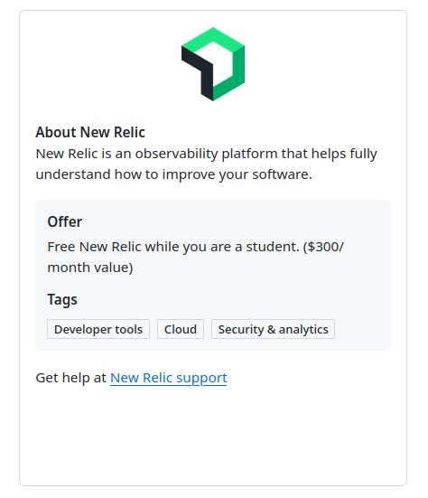
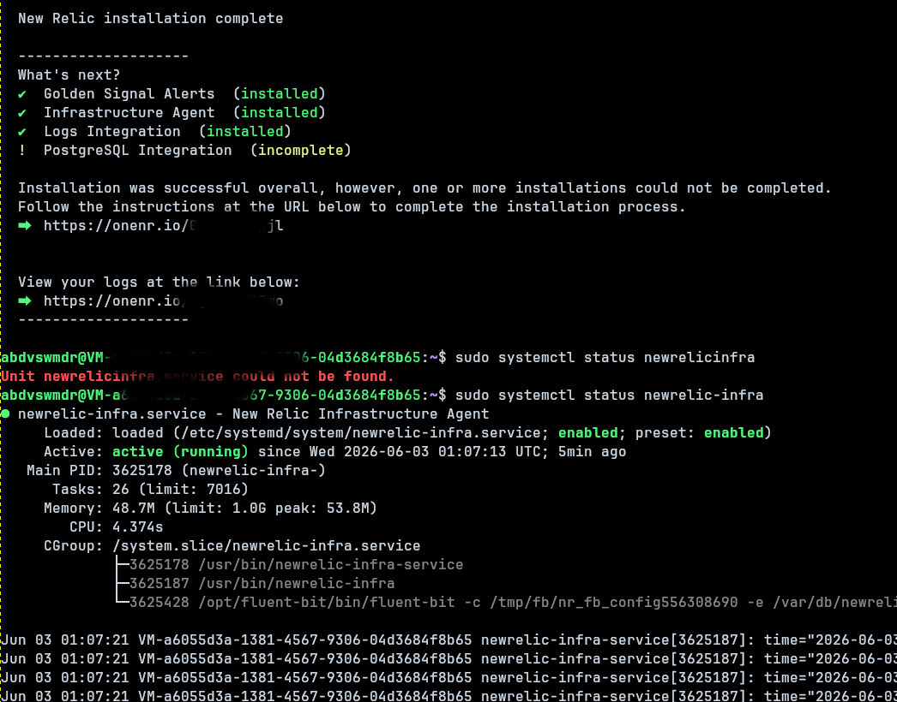
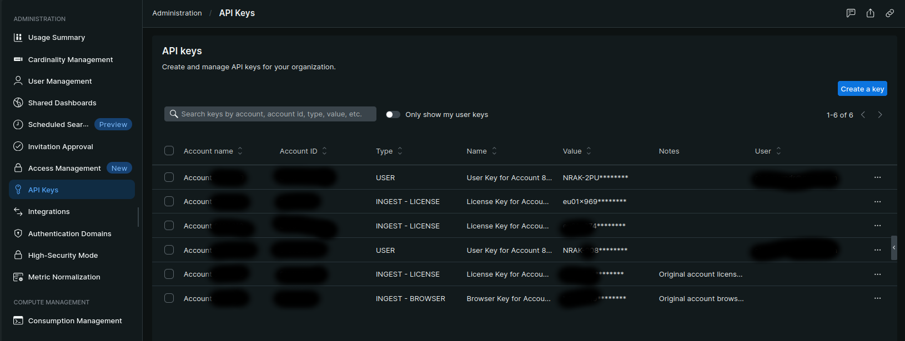
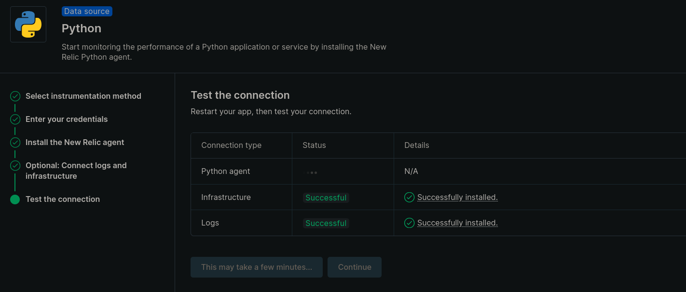
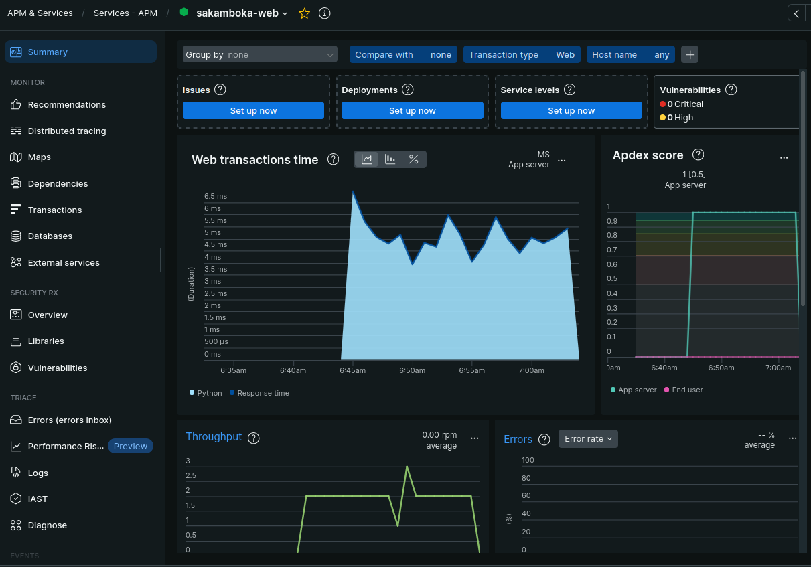

The infra agent worked immediately. The Python APM agent spent an hour rejecting the same license key that was already authenticating the infra agent. Same account. Same VPS. Same key. One worked, one didn't.

That's the story.

---

## Getting New Relic free via GitHub Student Dev Pack

If you have a `.edu` email or a GitHub Student account, the [GitHub Student Developer Pack](https://education.github.com/pack) includes a New Relic Pro subscription — the full observability platform, not a trial.



To claim it:

1. Go to [education.github.com/pack](https://education.github.com/pack) and verify your student status if you haven't already.
2. Search for "New Relic" in the pack offers.
3. Click the offer — it redirects to New Relic's partner page. Or simply [sign up directly](https://newrelic.com/students) if you're logged in to your existing GitHub account 
4. Create a New Relic account via GitHub.
5. The Pro plan activates automatically. Your account is provisioned in one of two regions: US or EU. If you're outside North America, you'll likely get EU (`one.eu.newrelic.com`).

Region matters later.

---

## What I'm monitoring

The target: a Flask app running in Docker on a single VPS. Stack:

- Flask + Gunicorn (2 workers, 2 threads)
- PostgreSQL 16 in a sidecar container
- Nginx in front, TLS via Let's Encrypt
- `docker-compose.yml` as the orchestrator

The goal:
1. **Infrastructure metrics** — CPU, memory, disk on the host
2. **Log forwarding** — Flask app logs into New Relic Logs
3. **Python APM** — request traces, error rates, slow transaction data

---

## Step 1: Install the infra agent

New Relic's guided install gives you a one-liner. For an EU account:

```bash
curl -Ls https://download.newrelic.com/install/newrelic-cli/scripts/install.sh | bash && \
  sudo NEW_RELIC_API_KEY=<your-api-key> \
       NEW_RELIC_ACCOUNT_ID=<your-account-id> \
       NEW_RELIC_REGION=EU \
       /usr/local/bin/newrelic install
```

The installer is interactive. It detects your OS, offers integrations (PostgreSQL, nginx, etc.), and installs `newrelic-infra` as a systemd service, Fluent Bit for log forwarding, and Golden Signal alert policies.

When it asked for PostgreSQL credentials, I skipped — PostgreSQL runs inside Docker with no port exposed to the host. The infra agent runs on the host and can't reach it. Skip it.



After install, `sudo systemctl status newrelic-infra` shows active. The license key is stored at `/etc/newrelic-infra.yml` — you'll need it later.

---

## Step 2: Add the Python APM agent to Flask

The plan:

1. Add `newrelic>=9.0` to `pyproject.toml`
2. Drop a `newrelic.ini` config file in the repo
3. Change the Gunicorn CMD to `newrelic-admin run-program gunicorn ...`
4. Pass the license key via environment variable

### The config file

The New Relic setup wizard generates a `newrelic.ini`. Strip the license key out — don't commit it to git — and keep the meaningful settings:

```ini
[newrelic]
app_name = your-app-name

monitor_mode = true
log_file = stdout
log_level = info

distributed_tracing.enabled = true
otlp_host = otlp.eu01.nr-data.net

transaction_tracer.enabled = true
transaction_tracer.record_sql = obfuscated

error_collector.enabled = true
application_logging.enabled = true
application_logging.forwarding.enabled = true

[newrelic:production]
monitor_mode = true
```

Do not put `license_key =` in this file — not even empty. An explicit empty value is ambiguous. The `NEW_RELIC_LICENSE_KEY` env var handles it cleanly.

### Dockerfile change

```dockerfile
CMD ["newrelic-admin", "run-program", "gunicorn", \
     "-w", "2", "--threads", "2", "--timeout", "120", \
     "-b", "0.0.0.0:5000", "server:app"]
```

### docker-compose.yml

```yaml
environment:
  NEW_RELIC_CONFIG_FILE: /home/appuser/app/newrelic.ini
  NEW_RELIC_ENVIRONMENT: production
  NEW_RELIC_HOST: collector.eu01.nr-data.net
```

The license key lives in a gitignored `.env` on the server, loaded via `env_file:`:

```bash
NEW_RELIC_LICENSE_KEY=eu01x<your-key>NRAL
```

---

## Step 3: The license key that didn't work

Deployed. Checked logs:

```
newrelic.core.agent INFO - New Relic Python Agent (13.1.0)
newrelic.core.agent_protocol ERROR - Data collector is indicating that
an incorrect license key has been supplied by the agent.
```

I tried three keys:

1. The one generated by the New Relic Python setup wizard — rejected
2. The "Original account license" key from the API Keys admin page — rejected
3. A fresh INGEST - LICENSE key created manually in the UI — rejected

The infra agent was running fine on the same host the whole time.



**A note on copying keys from New Relic:** the table masks all key values as `eu01×xxx*****`. The `...` row menu has "Copy key ID" (the ID, not the value) and "Edit" shows the value masked in a form. The only way to get the full value is to create a new key and copy it at creation — shown once, then masked permanently.

---

## The actual problem

The infra agent was installed with `NEW_RELIC_REGION=EU` explicitly — it knew to send data to the EU collector. The Python agent had no such directive. It's supposed to auto-detect the EU region from the `eu01` license key prefix, but version 13.1.0 wasn't doing it reliably.

The Python agent was connecting to the US APM collector (`collector.newrelic.com`) with an EU-region key. The US collector correctly said: this key doesn't belong here.

Fix: one env var.

```yaml
NEW_RELIC_HOST: collector.eu01.nr-data.net
```

Redeployed. Logs:

```
newrelic.core.agent INFO - New Relic Python Agent (13.1.0)
newrelic.core.agent_protocol INFO - Reporting to:
  https://one.eu.newrelic.com/redirect/entity/...
```

Connected.



---

## What you end up with

**Infrastructure tab** — CPU, memory, disk, network I/O on the host. The `newrelic-infra` service uses about 48MB RSS.

**Logs tab** — Flask app logs, Gunicorn worker logs, all searchable. Filtering by `level:error` across everything in one query is useful.

**APM & Services** — request throughput per route, response time distribution, error rate, slow transaction traces, and Python exception capture with full stack traces.

**Golden Signal Alerts** — pre-configured policies that email you if CPU spikes, error rate jumps, throughput drops, or response time degrades.



---

## EU account checklist

If your New Relic account is EU (`one.eu.newrelic.com`):

| Where | Setting | Value |
|---|---|---|
| `.env` | `NEW_RELIC_LICENSE_KEY` | Your INGEST - LICENSE key |
| `docker-compose.yml` env | `NEW_RELIC_HOST` | `collector.eu01.nr-data.net` |
| `newrelic.ini` | `otlp_host` | `otlp.eu01.nr-data.net` |
| Install CLI flag | `NEW_RELIC_REGION` | `EU` |

Miss `NEW_RELIC_HOST` on the Python agent and you'll spend an hour on a key rejection that is a region mismatch.
